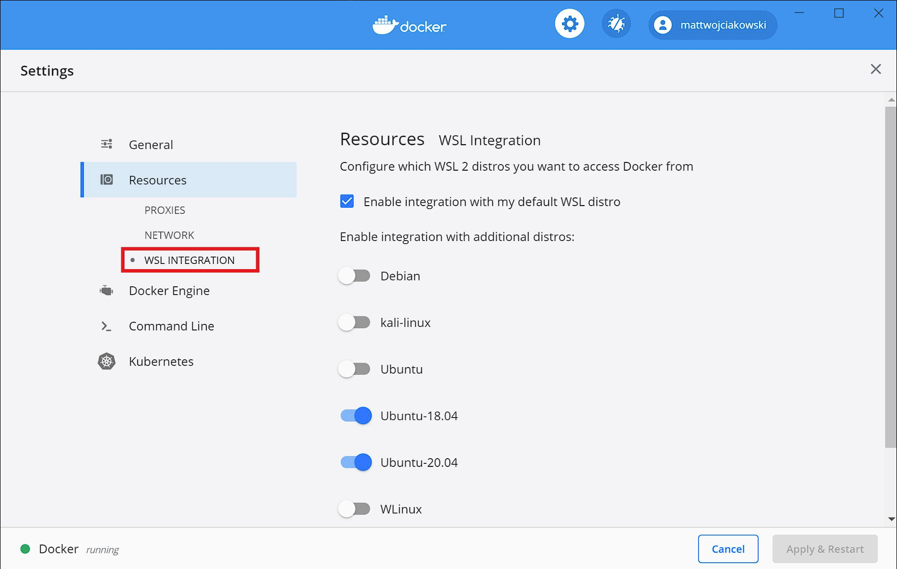
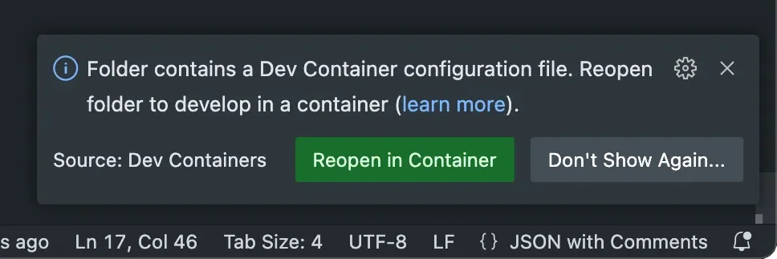

# 使用dev-containers进行开发

Dev Containers 是一种将 Docker 容器作为完整开发环境的技术方案，通过 `.devcontainer/devcontainer.json` 配置文件定义环境镜像、工具链、依赖和 VS Code 设置，实现跨设备、跨团队的一致性开发体验。

## 开始

需要vscode安装Dev Containers 扩展。对于windows环境同时需要依赖于wsl环境，建议安装ubuntu，不建议使用安装时自动创建的docker-desktop，并且通过 Docker Desktop → Settings → Resources → WSL Integration 开启 WSL 集成



## devcontainer.json

### 最小配置

只需要配置 `image` 字段即可，有很多模板可以从 [这里](https://containers.dev/templates) 找到

```json
{
  "image": "ghcr.io/devcontainers/templates/cpp:4.0.0"
}
```

完整配置可以参考 [Dev Container metadata reference](https://containers.dev/implementors/json_reference/)

### features

features是容器层在基础模板之上添加额外的内容，例如 [common-utils](https://github.com/devcontainers/features/tree/main/src/common-utils)，可以在基础模板之上配置`zsh`等。例如

```json
{
    "image":  "ghcr.io/devcontainers/templates/cpp:4.0.0",
    "features": {
        "ghcr.io/devcontainers/features/common-utils:2": {
            "configureZshAsDefaultShell": ture
        }
    }
}
```

这会为我们的容器配置`zsh`并设置为默认shell

更多feature可以参考 [这里](https://containers.dev/features)

## 进行开发

在**wsl**环境内，创建`.devcontainer/devcontainer.json`，使用`code .`即可在wsl中打开该文件夹。此时vscode右下角会提示 `Reopen in Container`



或者 `Ctrl Shift + p` 输入 `Reopen in Container`。等待拉取docker镜像。

> 不建议在windows环境中创建`.devcontainer/devcontainer.json`，一是跨文件系统io性能较差；二是这样会默认使用docker desktop安装时创建的wsl，配置[wslg](https://learn.microsoft.com/zh-cn/windows/wsl/tutorials/gui-apps)较为麻烦。
