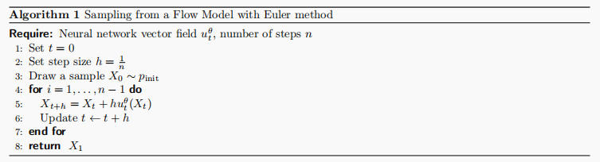
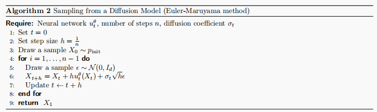
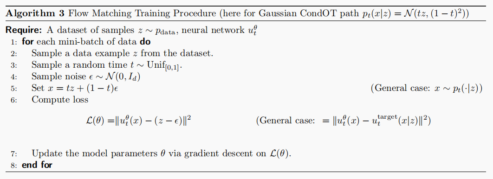
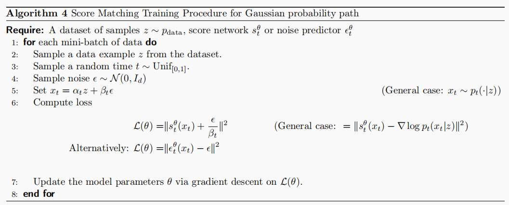
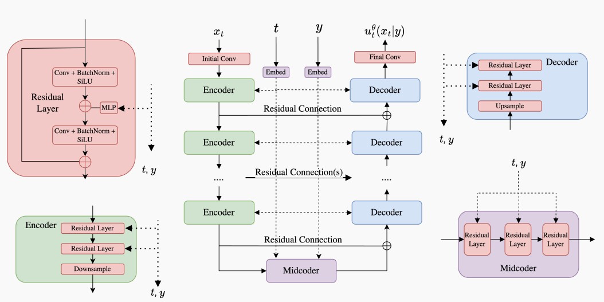
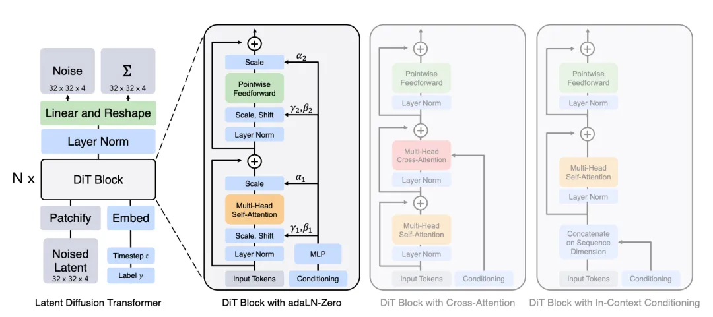

## Introduction

生成对象（Object）：对图像，视频，蛋白质等数据类型可视为向量，即 $z \in \mathbb{R}^d$

生成（Generation）：从数据分布中采样，$z \sim p_{data}$

数据集（Dataset）：服从数据分布的有限样本，$z_1, ...,z_N \sim p_{data}$

条件生成（Conditional Generation）：从条件分布中采样，$z \sim p_{data}(\cdot \mid y)$

目标：训练生成模型，将初始分布（$p_{\text{init}}$）的样本转化为数据分布样本$p_{\text{data}}$

## Flow and Diffusion Models

通过模拟常微分方程（Ordinary Differential Equations, ODEs）和随机微分方程（Stochastic Differential Equations, SDEs）可以实现从初始分布到数据分布的转换，分别对应Flow Model和Diffusion Model

### Flow Models

Flow Model可以由ODE来描述，即

$$
X_0 \sim p_{\text{init}} \quad \triangleright \text{random init}\\
\frac{d}{dt}X_t=u_t^\theta(X_t) \quad \triangleright \text{ODE} \\
\text{Goal: } X_1 \sim p_{\text{data}} \Leftrightarrow \psi_{1}^{\theta}(X_0) \sim p_{\text{data}}
$$

其中向量场 $u_t^\theta: \mathbb{R}^d\times[0,1] \rightarrow \mathbb{R}^d$ 为神经网络，$\theta$为参数。$\psi^\theta_t$描述了由$u_t^\theta$引起的Flow，为ODE方程解（Trajectory）的集合

通过使用Euler算法，可以模拟ODE计算出Flow，实现从Flow Model中采样

### Diffusion Models

Diffusion Model可以由SDEs描述，如下所示（由于其随机性SDEs不使用微分表示形式）

$$
dX_t = u_t^\theta(X_t)dt +\sigma_tdW_t \quad \triangleright \text{SDE} \\
X_0 \sim p_{init} \quad \triangleright \text{random initialization} \\
\text{Goal: } X_1 \sim p_{\text{data}}
$$

其中 $\sigma_t \geq 0$为diffusion系数，$W_t$为随机过程 布朗运动（Brownian motion）

可以看出Diffusion Model是Flow Model的一个拓展，当$\sigma_t = 0$时即为Flow Model

同样的，可以使用以下算法实现从Diffusion Model中采样

## Training Target and Train Loss

对于Flow Model和Diffusion Model

$$
\begin{align*}
X_0 \sim p_{\text{init}},\quad dX_t &= u_t^\theta(X_t) dt & \text{(Flow model)} \\
X_0 \sim p_{\text{init}},\quad dX_t &= u_t^\theta(X_t) dt + \sigma_t dW_t & \text{(Diffusion model)}
\end{align*}
$$

训练可以通过最小化以下损失实现

$$
\mathcal{L}(\theta) = \left\| u_t^\theta(x) - \underbrace{u_t^{\text{target}}(x)}_{\text{training target}} \right\|^2
$$

$u_t^\theta$ 为网络模型，$u_t^{\text{target}}(x)$为目标向量场，其实现将初始数据分布转化为目标数据分布，为了实现计算 $\mathcal{L}(\theta)$ 或者间接计算 $\mathcal{L}(\theta)$需要构建$u_t^{\text{target}}(x)$。

### Probability Path

Probability Path是从初始分布到目标数据分布的渐进插值（gradual interpolation），分为条件概率路径（conditional probability path）和边缘概率路径（marginal probability path），分别为$p_t(\cdot \mid z)$ 和 $p_t(\cdot)$，其中：

$$
p_0(\cdot \mid z) = p_{\text{init}}, \quad p_1(\cdot \mid z) = \delta_z \quad \text{for all } z \in \mathbb{R}^d
$$

$p_t(\cdot)$ 可由以下公式获得

$$
\begin{align*}
&z \sim p_{\text{data}},\ x \sim p_t(\cdot \mid z) \implies x \sim p_t &\triangleright \text{sampling from marginal path} \\
&p_t(x) = \int p_t(x \mid z) p_{\text{data}}(z)dz &\triangleright \text{density of marginal path} \\
&p_0 = p_{\text{init}} \quad \text{and} \quad p_1 = p_{\text{data}}
&\triangleright \text{noise-data interpolation} \\
\end{align*}
$$

### Training Target for Flow Model

对于$z \in \mathbb{R^d} \sim p_{data}$，记$u_t^{target}(\cdot \mid z)$为条件概率路径 $p_t(\cdot \mid z)$ 对应的条件向量场，即

$$
X_0 \sim p_{\text{init}},\quad \frac{\mathrm{d}}{\mathrm{d}t}X_t = u_t^{\text{target}}(X_t|z) \quad \Rightarrow \quad X_t \sim p_t(\cdot|z) \quad (0 \leq t \leq 1)
$$

则$u_t^{target}(x)$可定义为

$$
u_t^{\text{target}}(x) = \int u_t^{\text{target}}(x|z) \frac{p_t(x|z)p_{\text{data}}(z)}{p_t(x)} \,\mathrm{d}z
$$

且满足：

$$
X_0 \sim p_{\text{init}},\quad \frac{\mathrm{d}}{\mathrm{d}t}X_t = u_t^{\text{target}}(X_t) \quad \Rightarrow \quad X_t \sim p_t \quad (0 \leq t \leq 1)
$$

其中$X_1 \sim p_{data}$。

这可以由**Continuity Equation** 证明

> **Continuity Equation**
>
> 对于向量场$u_t^{target}$ 且 $X_0 \sim p_{init}$，有$X_t \sim p_t$ 在$0 \leq t \leq 1$ 成立有且仅有
>
> $$
> \partial_t p_t(x) = -\mathrm{div}(p_t u_t^{\text{target}})(x) \quad \text{for all } x \in \mathbb{R}^d, 0 \leq t \leq 1
> $$
>
> 其中$\partial_t p_t(x) = \frac{\mathrm{d}}{\mathrm{d}t} p_t(x)$，$\mathrm{div}(v_t)(x) = \sum_{i=1}^d \frac{\partial}{\partial x_i} v_t(x)$

### Training Target for Diffusion Model

同样的，对于Diffusion Model，可以构建$u_t^{target}$如下所示，满足$X_t \sim p_t \quad (0 \leq t \leq 1)$ ，即

$$
\begin{align*}
&X_0 \sim p_{\text{init}}, \quad \mathrm{d}X_t = \left[ u_t^{\text{target}}(X_t) + \frac{\sigma_t^2}{2} \nabla \log p_t(X_t) \right] \mathrm{d}t + \sigma_t \mathrm{d}W_t \\
&\Rightarrow X_t \sim p_t \quad (0 \leq t \leq 1)
\end{align*}
$$

并且将$p_t(x), u_t^{target}$ 替换为 $p_t(x\mid z), u_t^{target}(x \mid z)$ 时仍然成立

其中，$\nabla \log p_t(x)$ 称为marginal score function，$\nabla \log p_t(x \mid z)$ 称为conditional score function，二者满足

$$
\nabla \log p_t(x) = \frac{\nabla p_t(x)}{p_t(x)} = \frac{\nabla \int p_t(x|z) p_{\text{data}}(z) \,\mathrm{d}z}{p_t(x)} = \frac{\int \nabla p_t(x|z) p_{\text{data}}(z) \,\mathrm{d}z}{p_t(x)} = \int \nabla \log p_t(x|z) \frac{p_t(x|z) p_{\text{data}}(z)}{p_t(x)} \,\mathrm{d}z
$$

这可以由Fokker-Planck Equation证明

> **Fokker-Planck Equation**
>
> 对于$X_0 \sim p_{\text{init}}, \quad \mathrm{d}X_t = u_t(X_t)\,\mathrm{d}t + \sigma_t\,\mathrm{d}W_t$ 描述的SDE，$X_t \sim p_t$ 成立，当且仅当
>
> $$
> \partial_t p_t(x) = -\mathrm{div}(p_t u_t)(x) + \frac{\sigma_t^2}{2} \Delta p_t(x) \quad \text{for all } x \in \mathbb{R}^d, 0 \leq t \leq 1
> $$
>
> 其中，$\Delta w_t(x) = \sum_{i=1}^d \frac{\partial^2}{\partial x_i^2} w_t(x) = \mathrm{div}(\nabla w_t)(x)$

> **Remark** Langevin dynamics

> 当$p_t=p$时，即概率路径为静态时，有
>
> $$
> \mathrm{d}X_t = \frac{\sigma_t^2}{2} \nabla \log p(X_t)\,\mathrm{d}t + \sigma_t\,\mathrm{d}W_t
> $$
>
> 此时 $X_0 \sim p \quad \Rightarrow \quad X_t \sim p \quad (t \geq 0)$，即Langevin dynamics

### Gaussian probability path

设噪声调度$\alpha_t, \beta_t$为单调连续可微函数且$\alpha_0=\beta_1=0, \alpha_1=\beta_0=1$，定义Gaussian conditional probability path为

$$
p_t(\cdot|z) = \mathcal{N}(\alpha_t z, \beta_t^2 I_d)
$$

其满足 $p_0(\cdot|z) = \mathcal{N}(\alpha_0 z, \beta_0^2 I_d) = \mathcal{N}(0, I_d), \quad \text{and} \quad p_1(\cdot|z) = \mathcal{N}(\alpha_1 z, \beta_1^2 I_d) = \delta_z$

则从其marginal path中采样可以通过以下方法得到

$$
z \sim p_{\text{data}},\ \epsilon \sim p_{\text{init}} = \mathcal{N}(0, I_d) \Rightarrow x = \alpha_t z + \beta_t \epsilon \sim p_t
$$

基于Gaussian probability path的conditional Gaussian vector field可以计算得到

$$
u_t^{\text{target}}(x|z) = \left( \dot{\alpha}_t - \frac{\dot{\beta}_t}{\beta_t} \alpha_t \right) z + \frac{\dot{\beta}_t}{\beta_t} x
$$

其中$\dot{\alpha}_t = \partial_t \alpha_t$，$\dot{\beta}_t = \partial_t \beta_t$

同样的可以得到其marginal score function为

$$
\nabla \log p_t(x|z) = -\frac{x - \alpha_t z}{\beta_t^2}
$$

### Flow Matching

对于Flow Model，定义flow matching loss为

$$
\begin{align*}
\mathcal{L}_{\text{FM}}(\theta) &= \mathbb{E}_{t \sim \text{Unif}, x \sim p_t}[\|u_t^\theta(x) - u_t^{\text{target}}(x)\|^2] \\
&= \mathbb{E}_{t \sim \text{Unif}, z \sim p_{\text{data}}, x \sim p_t(\cdot|z)}[\|u_t^\theta(x) - u_t^{\text{target}}(x)\|^2]
\end{align*}
$$

> $z \sim p_{\text{data}},\ x \sim p_t(\cdot \mid z) \implies x \sim p_t$

定义conditional flow matching loss为

$$
\mathcal{L}_{\text{CFM}}(\theta) = \mathbb{E}_{t \sim \text{Unif}, z \sim p_{\text{data}}, x \sim p_t(\cdot|z)}[\|u_t^\theta(x) - u_t^{\text{target}}(x|z)\|^2]
$$

其中$u_t^{\text{target}}(x|z)$可以人为构造获得（例如Gaussian probability path）

可以证明，

$$
\mathcal{L}_{\text{FM}}(\theta) = \mathcal{L}_{\text{CFM}}(\theta) + C
$$

即

$$
\nabla_\theta \mathcal{L}_{\text{FM}}(\theta) = \nabla_\theta \mathcal{L}_{\text{CFM}}(\theta)
$$

因此优化$\mathcal{L}_{\text{CFM}}$即优化$\mathcal{L}_{\text{FM}}$，而对于$\mathcal{L}_{\text{CFM}}$，只需构造probability path即可，至此可以得到训练Flow Model的算法，整个流程即称为Flow Matching

**Flow Matching for Gaussian Conditional Probability Paths**

对于Gaussian Probability Path，有

$$
\epsilon \sim \mathcal{N}(0, I_d) \quad \Rightarrow \quad x_t = \alpha_t z + \beta_t \epsilon \sim \mathcal{N}(\alpha_t z, \beta_t^2 I_d) = p_t(\cdot|z)
$$

$$
u_t^{\mathrm{target}}(x|z)=\left(\dot{\alpha}_t-\frac{\dot{\beta}_t}{\beta_t}\alpha_t\right)z+\frac{\dot{\beta}_t}{\beta_t}x
$$

$$
\begin{gathered}
\mathcal{L}_{\mathrm{CFM}}(\theta)=\mathbb{E}_{t\sim\mathrm{Unif},z\sim p_{\mathrm{data}},x\sim\mathcal{N}(\alpha_{t}z,\beta_{t}^{2}I_{d})}[\|u_{t}^{\theta}(x)-\left(\dot{\alpha}_{t}-\frac{\dot{\beta}_{t}}{\beta_{t}}\alpha_{t}\right)z-\frac{\dot{\beta}_{t}}{\beta_{t}}x\|^{2}] \\
\overset{(i)}{\operatorname*{=}}\mathbb{E}_{t\sim\mathrm{Unif},z\sim p_{\mathrm{data}},\epsilon\sim\mathcal{N}(0,I_{d})}[\|u_{t}^{\theta}(\alpha_{t}z+\beta_{t}\epsilon)-(\dot{\alpha}_{t}z+\dot{\beta}_{t}\epsilon)\|^{2}]
\end{gathered}
$$

特别的，对于$\alpha_t=t$，$\beta_t=1-t$，有

$$
p_{t}(x|z)=\mathcal{N}(tz,(1-t)^{2})
$$

$$
\mathcal{L}_{\mathrm{cfm}}(\theta)=\mathbb{E}_{t\sim\mathrm{Unif},z\sim p_{\mathrm{data}},\epsilon\sim\mathcal{N}(0,I_{d})}[\|u_{t}^{\theta}(tz+(1-t)\epsilon)-(z-\epsilon)\|^{2}]
$$

称之为(Gaussian) **CondOT probability path**，训练过程如下所示

### Score Matching

对于Diffusion Models，由于$u_t^{target}$ 难以得到，因此使用**score network** $\sigma_t^2 : \mathbb{R}^d \times [0, 1] \to \mathbb{R}$对score function进行拟合，同样的，存在score matching loss和conditional score matching loss如下

$$
\begin{align*}
\mathcal{L}_{\text{SM}}(\theta) &= \mathbb{E}_{t \sim \text{Unif}, z \sim p_{\text{data}}, x \sim p_t(\cdot|z)}[\|s_t^\theta(x) - \nabla \log p_t(x)\|^2] \quad \triangleright \text{ score matching loss} \\
\mathcal{L}_{\text{CSM}}(\theta) &= \mathbb{E}_{t \sim \text{Unif}, z \sim p_{\text{data}}, x \sim p_t(\cdot|z)}[\|s_t^\theta(x) - \nabla \log p_t(x|z)\|^2] \quad \triangleright \text{ conditional score matching loss}
\end{align*}
$$

同样的，虽然$\nabla \log p_t(x)$未知，但$\nabla \log p_t(x \mid z)$可以人工构造，且存在

$$
\begin{align*}
&\mathcal{L}_{\text{SM}}(\theta) = \mathcal{L}_{\text{SFM}}(\theta) + C \\
&\implies \nabla_\theta \mathcal{L}_{\text{SM}}(\theta) = \nabla_\theta \mathcal{L}_{\text{CSM}}(\theta)
\end{align*}
$$

因此，优化$\mathcal{L}_{\text{CSM}}(\theta)$即可，此时采样过程如下所示

$$
X_0 \sim p_{\text{init}}, \quad \mathrm{d}X_t = \left[ u_t^\theta(X_t) + \frac{\sigma_t^2}{2} s_t^\theta(X_t) \right] \mathrm{d}t + \sigma_t \mathrm{d}W_t \implies X_1 \sim p_{data}
$$

其中，尽管理论上对任意$\sigma_t \geq 0$均可实现采样，但由于存在对随机微分方程模拟不精确导致的精度误差，以及训练误差，因此存在一个最优的$\sigma_t$。同时观察采样过程可以发现模拟该SDE还需学习$u_t^\theta$，但其实通常可以使用一个两输出的网络同时处理$u_t^\theta$和$s_t^\theta$，并且对于特定的概率路径，两者可以相互转化。

**Denoising Diffusion Models: Score Matching for Gaussian Probability Paths**

对于Gaussian Probability Paths，有

$$
\nabla \log p_t(x|z) = -\frac{x - \alpha_t z}{\beta_t^2}
$$

则

$$
\begin{align*}
\mathcal{L}_{\text{CSM}}(\theta) &= \mathbb{E}_{t \sim \text{Unif}, z \sim p_{\text{data}}, x \sim p_t(\cdot|z)}\left[\left\|s_t^\theta(x) + \frac{x - \alpha_t z}{\beta_t^2}\right\|^2\right] \\
&= \mathbb{E}_{t \sim \text{Unif}, z \sim p_{\text{data}}, \epsilon \sim \mathcal{N}(0, I_d)}\left[\left\|s_t^\theta(\alpha_t z + \beta_t \epsilon) + \frac{\epsilon}{\beta_t}\right\|^2\right] \\
&= \mathbb{E}_{t \sim \text{Unif}, z \sim p_{\text{data}}, \epsilon \sim \mathcal{N}(0, I_d)}\left[\frac{1}{\beta_t^2} \left\|\beta_t s_t^\theta(\alpha_t z + \beta_t \epsilon) + \epsilon\right\|^2\right]
\end{align*}
$$

由于$\frac{1}{\beta^2_t}$在$\beta_t$趋近于0时loss趋近于无穷大，因此通常舍弃常数项$\frac{1}{\beta^2_t}$，并用以下方法reparameterize $s^\theta_t$为$\epsilon_t^\theta$（噪声预测网络）得到DDPM损失函数

$$
-\beta_t s_t^\theta(x) = \epsilon_t^\theta(x) \quad \Rightarrow \quad \mathcal{L}_{\text{DDPM}}(\theta) = \mathbb{E}_{t \sim \text{Unif}, z \sim p_{\text{data}}, \epsilon \sim \mathcal{N}(0, I_d)}\left[\left\|\epsilon_t^\theta(\alpha_t z + \beta_t \epsilon) - \epsilon\right\|^2\right]
$$

其训练过程如下所示

此外，对于Gaussian Probability Paths，vector field和score可以相互转化，即

$$
u_t^{\text{target}}(x|z) = \left( \beta_t^2 \frac{\dot{\alpha}_t}{\alpha_t} - \dot{\beta}_t \beta_t \right) \nabla \log p_t(x|z) + \frac{\dot{\alpha}_t}{\alpha_t} x \\
u_t^{\text{target}}(x) = \left( \beta_t^2 \frac{\dot{\alpha}_t}{\alpha_t} - \dot{\beta}_t \beta_t \right) \nabla \log p_t(x) + \frac{\dot{\alpha}_t}{\alpha_t} x
$$

> _proof_
>
> $$
> u_t^{\text{target}}(x|z) = \left( \dot{\alpha}_t - \frac{\dot{\beta}_t}{\beta_t} \alpha_t \right) z + \frac{\dot{\beta}_t}{\beta_t} x
> \stackrel{(i)}{=} \left( \beta_t^2 \frac{\dot{\alpha}_t}{\alpha_t} - \dot{\beta}_t \beta_t \right) \left( \frac{\alpha_t z - x}{\beta_t^2} \right) + \frac{\dot{\alpha}_t}{\alpha_t} x
> = \left( \beta_t^2 \frac{\dot{\alpha}_t}{\alpha_t} - \dot{\beta}_t \beta_t \right) \nabla \log p_t(x|z) + \frac{\dot{\alpha}_t}{\alpha_t} x
> $$
>
> $$
> \begin{align*}
> u_t^{\text{target}}(x) &= \int u_t^{\text{target}}(x|z) \frac{p_t(x|z) p_{\text{data}}(z)}{p_t(x)} \,\mathrm{d}z \\
> &= \int \left[ \left( \beta_t^2 \frac{\dot{\alpha}_t}{\alpha_t} - \dot{\beta}_t \beta_t \right) \nabla \log p_t(x|z) + \frac{\dot{\alpha}_t}{\alpha_t} x \right] \frac{p_t(x|z) p_{\text{data}}(z)}{p_t(x)} \,\mathrm{d}z \\
> &\stackrel{(i)}{=} \left( \beta_t^2 \frac{\dot{\alpha}_t}{\alpha_t} - \dot{\beta}_t \beta_t \right) \nabla \log p_t(x) + \frac{\dot{\alpha}_t}{\alpha_t} x
> \end{align*}
> $$

$u_t^\theta$和$s^\theta_t$ 也可以相互转化，有

$$
u_t^\theta(x) = \left( \beta_t^2 \frac{\dot{\alpha}_t}{\alpha_t} - \dot{\beta}_t \beta_t \right) s_t^\theta(x) + \frac{\dot{\alpha}_t}{\alpha_t} x
$$

$$
s_t^\theta(x) = \frac{\alpha_t u_t^\theta(x) - \dot{\alpha}_t x}{\beta_t^2 \alpha_t - \alpha_t \dot{\beta}_t \beta_t}
$$

因此对于Gaussian probability paths来说，只需训练$u_t^\theta$或$s^\theta_t$ 即可，**且使用flow matching或者使用score matching的方法均可**

最后，对于训练好的$s_t^\theta$ 从SDE中采样过程如下

$$
X_0 \sim p_{\text{init}}, \quad \mathrm{d}X_t = \left[ \left( \beta_t^2 \frac{\dot{\alpha}_t}{\alpha_t} - \dot{\beta}_t \beta_t + \frac{\sigma_t^2}{2} \right) s_t^\theta(x) + \frac{\dot{\alpha}_t}{\alpha_t} x \right] \mathrm{d}t + \sigma_t \mathrm{d}W_t \\
\implies X_1=p_{data}
$$

### Summary

总的来说，Flow Matching比Score Matching更简洁并且Flow Matching更具有拓展性，可以实现从一个任意初始分布$p_{init}$得到任意分布$p_{data}$，但是denoising diffusion models只适用于Gaussian initial distributions and Gaussian probability path。Flow Matching类似于Stochastic Interpolants。

## Conditional (Guided) Generation

在给定条件下进行生成（generate an object **conditioned on** **some additional information**），称之为conditional generation，为了和conditional vector field区分多称为guided generation

用数学语言描述即，对于$y \in \mathcal{Y}$，对$p_{data}(x \mid y)$中采样，因此模型包含条件向量场$u_t^{\theta}(\cdot \mid y)$，模型架构如下所示

$$
\begin{align*}
\text{Neural network: } & u_t^\theta : \mathbb{R}^d \times \mathcal{Y} \times [0, 1] \to \mathbb{R}^d, \quad (x, y, t) \mapsto u_t^\theta(x|y) \\
\text{Fixed: } & \sigma_t : [0, 1] \to [0, \infty), \quad t \mapsto \sigma_t
\end{align*}
$$

对于给定的$y \in \mathbb{R}^{d_y}$，采样过程可以描述为

$$
\begin{align*}
\text{Initialization:} \quad & X_0 \sim p_{\text{init}} \quad &\triangleright \text{ Initialize with simple distribution} \\
\text{Simulation:} \quad & \mathrm{d}X_t = u_t^\theta(X_t|y)\,\mathrm{d}t + \sigma_t\,\mathrm{d}W_t \quad &\triangleright \text{ Simulate SDE from } t=0 \text{ to } t=1. \\
\text{Goal:} \quad & X_1 \sim p_{\text{data}}(\cdot|y) \quad &\triangleright  X_1 \text{ to be distributed like } p_{\text{data}}(\cdot|y)
\end{align*}
$$

上述在$\sigma_t=0$时即为guided flow model

### Guided Models

Guided Flow Models的训练损失（优化目标，或者说guided conditional flow matching objective）很容的得到，如下所示

$$
\begin{align*}
\mathcal{L}_{\text{CFM}}^{\text{guided}}(\theta) &= \mathbb{E}_{(z,y) \sim p_{\text{data}}(z,y),\, t \sim \text{Unif}(0,1),\, x \sim p_t(\cdot|z)} \left[ \left\| u_t^\theta(x|y) - u_t^{\text{target}}(x|z) \right\|^2 \right]
\end{align*}
$$

同样的，对于Guided Diffusion Models，有guided conditional score matching objective如下

$$
\begin{align*}
\mathcal{L}_{\text{CSM}}^{\text{guided}}(\theta) &= \mathbb{E}_{\square} \left[ \| s_t^\theta(x|y) - \nabla \log p_t(x|z) \|^2 \right] \\
\square &= (z, y) \sim p_{\text{data}}(z, y),\ t \sim \text{Unif}(0,1),\ x \sim p_t(\cdot|z)
\end{align*}
$$

虽然理论上上述以及足够生成标签$y$对应样本，但是实际上生成效果并不十分fit $y$，以及，无法控制生成内容对label的fit程度。一种解决方法是人为加强$y$的作用，比较先进的技术是Classifier-Free Guidance。

#### Classifier-Free Guidance

对于Flow Models，以Gaussian probability paths为例

$$
\begin{align*}
u_t^{\text{target}}(x|y) = a_t x + b_t \nabla \log p_t(x|y)
\end{align*}
$$

其中

$$
\begin{align*}
(a_t, b_t) = \left( \frac{\dot{\alpha}_t}{\alpha_t}, \frac{\dot{\alpha}_t \beta_t^2 - \dot{\beta}_t \beta_t \alpha_t}{\alpha_t} \right)
\end{align*}
$$

又

$$
\begin{align*}
\nabla \log p_t(x|y) = \nabla \log \left( \frac{p_t(x) p_t(y|x)}{p_t(y)} \right) = \nabla \log p_t(x) + \nabla \log p_t(y|x)
\end{align*}
$$

则

$$
\begin{align*}
u_t^{\text{target}}(x|y) = a_t x + b_t (\nabla \log p_t(x) + \nabla \log p_t(y|x)) = u_t^{\text{target}}(x) + b_t \nabla \log p_t(y|x)
\end{align*}
$$

可以看出，guided vector field是由unguided vector field和guided score相加得到，一种很自然的想法是对guided score进行加权，得到

$$
\begin{align*}
\tilde{u}_t(x|y) = u_t^{\text{target}}(x) + wb_t \nabla \log p_t(y|x)
\end{align*}
$$

其中guided score可以看作是噪声类别分类器，早期的工作确实使用这样的方法实现，但是进一步对guided score进行分析得到如下：

$$
\begin{align*}
\tilde{u}_t(x|y) &= u_t^{\text{target}}(x) + w_b \nabla \log p_t(y|x) \\
&= u_t^{\text{target}}(x) + w_b (\nabla \log p_t(x|y) - \nabla \log p_t(x)) \\
&= u_t^{\text{target}}(x) - (w_a x + w_b \nabla \log p_t(x)) + (w_a x + w_b \nabla \log p_t(x|y)) \\
&= (1 - w) u_t^{\text{target}}(x) + w u_t^{\text{target}}(x|y).
\end{align*}
$$

即$\tilde{u}_t(x|y)$由unguided vector field和guided vector field加权得到，并且，通过构造$y = \varnothing$其对应概率为人为设计的超参数$\eta$，从而实现使用$u_t^{\text{target}}(x|\varnothing)$代替$u_t^{\text{target}}(x)$，具体可公式化描述为

$$
\begin{align*}
\mathcal{L}_{\text{CFM}}^{\text{CFG}}(\theta) &= \mathbb{E}_{\square} \left[ \| u_t^\theta(x|y) - u_t^{\text{target}}(x|z) \|^2 \right] \\
\square &= (z, y) \sim p_{\text{data}}(z, y),\ t \sim \text{Unif}(0,1),\ x \sim p_t(\cdot|z),\ \text{replace } y = \varnothing \text{ with prob. } \eta
\end{align*}
$$

对于Diffusion Models，$\tilde{s}_t(x|y)$同样可改写如下

$$
\begin{align*}
\tilde{s}_t(x|y) &= \nabla \log p_t(x) + w \nabla \log p_t(y|x) \\
&= \nabla \log p_t(x) + w (\nabla \log p_t(x|y) - \nabla \log p_t(x)) \\
&= (1 - w) \nabla \log p_t(x) + w \nabla \log p_t(x|y) \\
&= (1 - w) \nabla \log p_t(x|\varnothing) + w \nabla \log p_t(x|y)
\end{align*}
$$

training objective如下

$$
\begin{align*}
\mathcal{L}_{\text{CSM}}^{\text{CFG}}(\theta) &= \mathbb{E}_{\square} \left[ \| s_t^\theta(x|(1 - \xi)y + \xi \varnothing) - \nabla \log p_t(x|z) \|^2 \right] \\
\square &= (z, y) \sim p_{\text{data}}(z, y),\ t \sim \text{Unif}(0,1),\ x \sim p_t(\cdot|z),\ \text{replace } y = \varnothing \text{ with prob. } \eta
\end{align*}
$$

训练时，我们通常也可同时优化${s}_t^\theta(x|y)$和${u}_t^\theta(x|y)$，对应的，有

$$
\begin{align*}
\tilde{s}_t^\theta(x|y) &= (1 - w) s_t^\theta(x|\varnothing) + w s_t^\theta(x|y), \\
\tilde{u}_t^\theta(x|y) &= (1 - w) u_t^\theta(x|\varnothing) + w u_t^\theta(x|y).
\end{align*}
$$

采样时，有

$$
\mathrm{d}X_t = \left[ \tilde{u}_t^\theta(X_t|y) + \frac{\sigma_t^2}{2} s_t^\theta(X_t|y) \right] \mathrm{d}t + \sigma_t \mathrm{d}W_t
$$

## Network architectures

网络模型的设计随建模数据的复杂程度各有差别，但都需满足

$$
\text{Neural network: }  u_t^\theta : \mathbb{R}^d \times \mathcal{Y} \times [0, 1] \to \mathbb{R}^d, \quad (x, y, t) \mapsto u_t^\theta(x|y)
$$

### U-Nets

### Diffusion Transformers

## References

[1] Peter Holderrieth and Ezra Erives.An Introduction to Flow Matching and Diffusion Models[EB/OL].https://arxiv.org/abs/2506.02070,2025.
