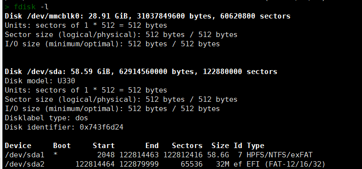
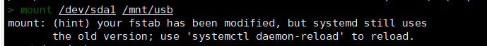
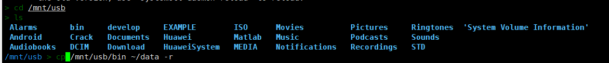
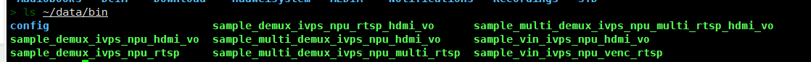

# ax650交叉编译ax-pipeline

## 编译前准备

- `x86 Linux`系统，虚拟机或者实体机，推荐选择`Ubuntu 22.04`
- 稳定网络环境(需要连接`github`)，若下载出现问题可参考[此处](#github镜像加速下载)
- U盘
- 安装基础编译包

```bash
sudo apt update
sudo apt install build-essential libopencv-dev cmake
```

## 交叉编译

- 拉取ax-pipeline源码及子模块

```bash
git clone --recursive https://github.com/AXERA-TECH/ax-pipeline.git
```

- 下载sdk及设置650n_bsp_sdk版本

```bash
cd ax-pipeline
./download_ax_bsp.sh ax650
./switch_version_ax650.sh 1.45
cd ax650n_bsp_sdk
wget https://github.com/ZHEQIUSHUI/assets/releases/download/ax650/drm.zip
mkdir third-party
unzip drm.zip -d third-party
cd ..
```

- 下载opencv

```bash
mkdir 3rdparty
cd 3rdparty
wget https://github.com/ZHEQIUSHUI/assets/releases/download/ax650/libopencv-4.5.5-aarch64.zip
unzip libopencv-4.5.5-aarch64.zip
```

- 配置交叉编译器

```bash
wget https://developer.arm.com/-/media/Files/downloads/gnu-a/9.2-2019.12/binrel/gcc-arm-9.2-2019.12-x86_64-aarch64-none-linux-gnu.tar.xz
tar -xvf gcc-arm-9.2-2019.12-x86_64-aarch64-none-linux-gnu.tar.xz
export PATH=$PATH:$PWD/gcc-arm-9.2-2019.12-x86_64-aarch64-none-linux-gnu/bin/
```

- 源码编译

```bash
cd ax-pipeline
mkdir build
cd build
cmake -DAXERA_TARGET_CHIP=AX650 -DBSP_MSP_DIR=$PWD/../ax650n_bsp_sdk/msp/out -DOpenCV_DIR=$PWD/../3rdparty/libopencv-4.5.5-aarch64/lib/cmake/opencv4 -DSIPY_BUILD=OFF -DCMAKE_BUILD_TYPE=Release -DCMAKE_TOOLCHAIN_FILE=../toolchains/aarch64-none-linux-gnu.toolchain.cmake -DCMAKE_INSTALL_PREFIX=install ..
make -j12
make install
```

- 获得bin文件如下所示

```bash
bin
├── config
│   ├── custom_model.json
│   ├── dinov2.json
│   ├── dinov2_depth.json
│   ├── glpdepth.json
│   ├── ppyoloe.json
│   ├── scrfd.json
│   ├── scrfd_recognition.json
│   ├── yolo_nas.json
│   ├── yolov5_seg.json
│   ├── yolov5s.json
│   ├── yolov5s_face.json
│   ├── yolov5s_face_recognition.json
│   ├── yolov6.json
│   ├── yolov7.json
│   ├── yolov7_face.json
│   ├── yolov8.json
│   ├── yolov8_pose.json
│   └── yolox.json
├── sample_demux_ivps_npu_hdmi_vo
├── sample_demux_ivps_npu_rtsp
├── sample_demux_ivps_npu_rtsp_hdmi_vo
├── sample_multi_demux_ivps_npu_hdmi_vo
├── sample_multi_demux_ivps_npu_multi_rtsp
├── sample_multi_demux_ivps_npu_multi_rtsp_hdmi_vo
├── sample_vin_ivps_npu_hdmi_vo
└── sample_vin_ivps_npu_venc_rtsp
```

## 移动到开发板

由于编译后文件较大，因此推荐使用U盘进行数据传输

- 将编译后bin文件移动到U盘中

- U盘插入板卡中

- 查看U盘所在分区



如图所示，我的U盘所在分区为`/dev/sda1` (根据大小或者其他来判断)

- 挂载到文件夹中(此处挂载到了`/mnt/usb`文件夹下)

```bash
mkdir /mnt/usb
mount /dev/sda1 /mnt/usb
```

_可能会有以下提示，不影响_



查看是否挂载



- 移动文件到板卡中(此处创建了`~/data目录`，并将文件移动到了`~/data/`下)

```
mkdir ~/data
cp /mnt/usb/bin ~/data -r
```

- 查看文件



- 运行默认示例，不传入模型参数(记得`kill fb_vo`进程)

```bash
cd ~/data/bin
./sample_vin_ivps_npu_hdmi_vo
```

- 移除U盘

卸载U盘

```bash
umount /dev/sda1 /mnt/usb
```

即可拔掉U盘

## github镜像加速下载

1. `git`拉取`ax-pipeline`源码加速

```bash
git clone https://kkgithub.com/AXERA-TECH/ax-pipeline.git
cd ax-pipeline
```

修改`ax-pipeline`下`.gitmodules`文件， 将`url =`中所有`github.com`换为`kkgithub.com`

**拉取子模块**

```bash
git submodule update --init
./download_ax_bsp.sh ax650
```

2. `wget`文件加速

替换`wget`下载链接中`github.com`为`kkgithub.com`
