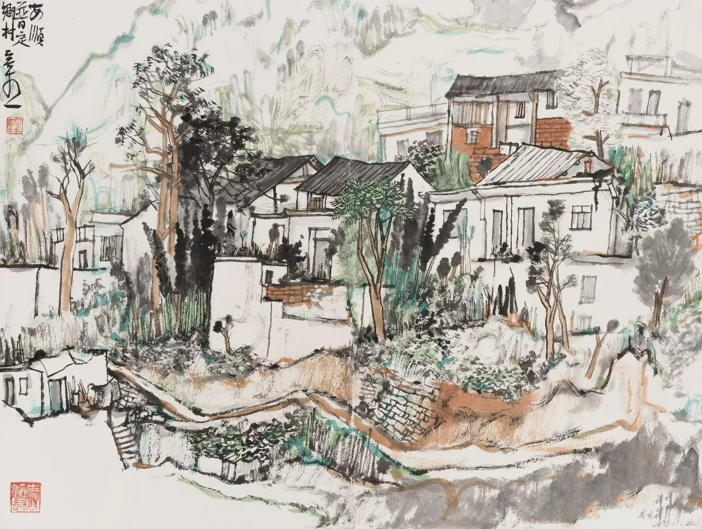

# 空山新雨后

> 空山新雨后，天气晚来秋
>
> 明月松间照，清泉石上流

山峰轻摆尾

卷下落花随流水

路过擦拭曾经 用你柔情 换我的眼泪

当爱恨都败退

没谢幕的人啊

井中月 举杯砸碎 佐一场宿醉

抽签的玫瑰

作熏香还(hai)能余味

猜测无解答案 算了满地 也是种浪费

我才终于明白

终于明白

不能被施舍的是爱

---

取下褪漆的钗

就化作尘埃

喝多少暖身的酒

暖不了心口

待空山新雨后

放一叶小舟

载上无人问津的温柔

摆渡寻处去忘忧

抽签的玫瑰

作熏香还能余味

猜测无解答案 算了满地 也是种浪费

我才终于明白

终于明白

不能被施舍的是爱

取下褪漆的钗

就化作尘埃

喝多少暖身的酒

暖不了心口

待空山新雨后

放一叶小舟

载上无人问津的温柔

摆渡寻处去忘忧
