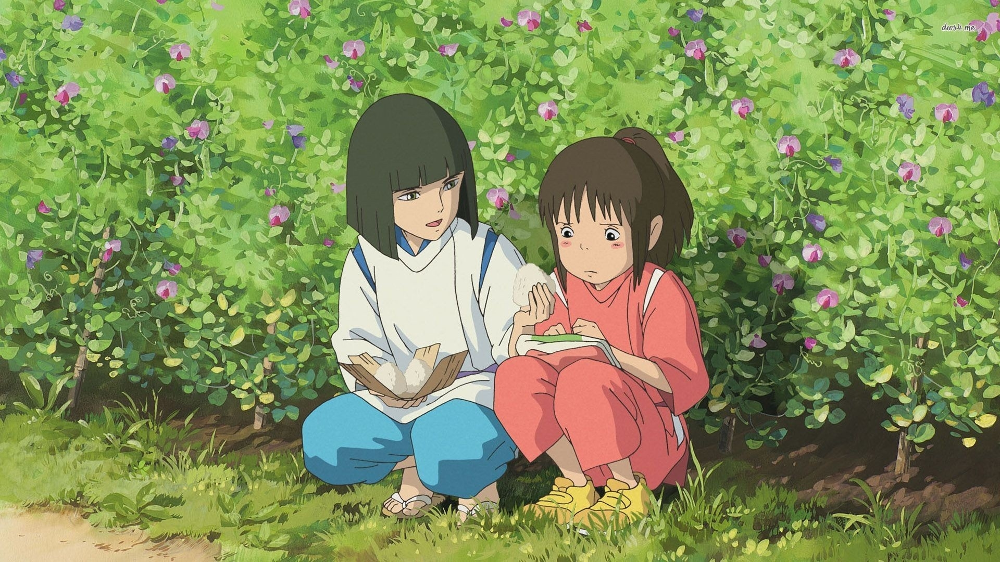

标准的 `HE` 故事，故事情节很精彩，主旨也很丰富。但是童话终究是童话。

比较深刻的一部分是关于无脸男。看电影前刚讨论过关于有的男生结婚前很好，但是结婚后会变坏；有的男生结婚前很坏，但是结婚后会变好。虽然变好变坏难以界定，但是仔细分析来说其变化无非出于内因和外因。无脸男只是一个容器，外界装入什么，就表现出什么。大浴场贪婪，其也就变得贪婪。钱婆婆和千寻善良，在她们的影响下他也不再贪婪。

这样来说，我们就很需要有非常强大的内心，和刚毅的坚守。像千寻一样，不被外界的贪婪干扰，再具体一点，就是保存本真。

是的，本真。忘记了自己的名字就忘记了自己是谁，忘记了自己的本真就会被别人控制，困扰。汤婆婆是这样来控制他人的。因此要记得自己的本心。

但是，世事无常，人生魔幻缤纷，能够保存自己本心的人少之又少，大抵到最后都拜倒在诱惑或者屈膝于生存。这样想来就有一种绝望感。

不过，宫崎骏像是给出了自己的答案，友情和爱情，千寻拯救无脸男，琥珀川和千寻相互救赎，最后事情都被解决，我们都有美好的未来。

然而，这仔细想来更让人有点失落，知己难以遇到，真爱更是如此，如果孤身一人看这部电影，初看很温馨，但是回过味来便很让人哭泣。带入千寻，或许当初掉进琥珀川的时候可能就被淹死了，闯进神明世界的时候就独自消失了，进到汤屋的时候就被变成了猪或者煤球。一切的一切都像是巧合，都只是童话。

这样去想又像是个消极主义者了，是我是消极主义者，还是世界影响着我让我变成了消极主义者？我是我，还是世界造就了我？

或许应该乐观点，自信点，宏大点。如果不能被理解，可以去理解他人；如果不能被救赎，去努力救赎他人。成为一个理想主义者，观察者和记录者。

---

 
 

电影中的名字也挺有特色，汤婆婆喜欢钱却却姓汤，钱婆婆不痴迷钱却姓钱，无脸男有脸却无心；千寻千寻，寻找的既是自己，也是自己爱的人。每个人的名字都很有意义，我要取个什么名字？

 
 
 

---

思考真的可以产生热量，刚刚还非常冷的手和胸膛，现在也火热了起来。
