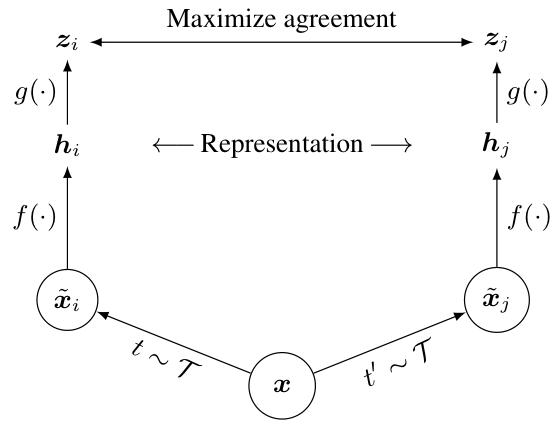
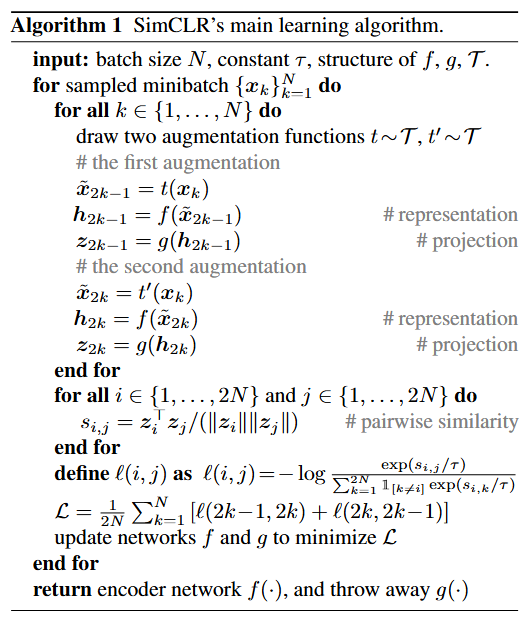

### 整体思想

SimCLR是自监督视觉表征对比学习算法，核心是学习具有强判别性与泛化性的图像表征（**不受数据增强/无关变异影响** —— 忽略裁剪、颜色变化、模糊等表面干扰；同时捕捉不同类别的核心语义） ~~，使同一类别图像在特征空间自然聚集（距离较近、相似度较高），不同类别图像在特征空间中分离（距离较远、相似度较低）~~ 。

> [https://zhuanlan.zhihu.com/p/197802321](https://zhuanlan.zhihu.com/p/197802321)
>
> 总而言之，CL的思想就是如果两个事物相似，那么我们希望这两个事物的编码也相似。实际上目前大部分的做法也都是降维后计算contrastive loss。然而，难点就在降维度的过程中 contrastive loss 与对比samples的设计。

实验结论：

**数据增强的组合**对定义有效预测任务至关重要

在表征与对比损失间引入**可学习的非线性变换**能显著提升表征质量

对比学习相比监督学习更受益于**更大的批次大小和更多训练step**；

‍

### 实现细节

SimCLR架构：

​​

- 随机数据增强 $\mathcal{T}$
- 视觉表征编码器 $f(\cdot)$
- projection head $g(\cdot)$，包含非线性激活函数
- 对比损失函数**NT-Xent（归一化温度缩放交叉熵）**
  - 余弦相似度 $sim(\boldsymbol{u}, \boldsymbol{v}) = \boldsymbol{u}^T \boldsymbol{v}/\|\boldsymbol{u}\| \|\boldsymbol{v}\|$
  - $\ell_{i,j} = -\log \frac{\exp(\text{sim}(z_i, z_j)/T)}{\sum_{k=1}^{2N} \mathbb{1}_{[k \neq i,j]} \exp(\text{sim}(z_i, z_k)/T)}$​

训练算法：

​​

对于一个batch的$N$个样本$\{x_k\}^N_{k=1}$，做两个不同的数据增强 $t \sim \mathcal{T}, t^{'} \sim \mathcal{T}$，得到$2N$个样本，其中$x_{2k-1},x_{2k}$是同一张样本图片的两个不同数据增强，经过$f(\cdot),g(\cdot)$得到$z_{2k-1},z_{2k}$

计算损失函数$\mathcal{L} = \frac{1}{2N} \sum_{k=1}^{N} \left[ \ell(2k-1, 2k) + \ell(2k, 2k-1) \right]$

实验中将batch中同一图片的不同数据增强作为正样本，不同图片的数据增强作为负样本，并且batch设置的很大（4096~8192），目的之一个人认为是为了减小同一类别的不同图片作为负样本的影响（因为此时他们的表征投影到低维应该相似）

‍

#### 非线性投影层可以有效提高其之前的表征质量

实验表明：非线性投影层 $g(\cdot)$ 的投影矩阵 $W$ 是低秩的，说明“少数维度承载主要有效信息”

矩阵的 “秩” 代表矩阵中**独立且有价值的信息维度数**。

- 高秩矩阵：多数维度都承载独特信息，没有明显的冗余；
- 低秩矩阵：仅需少数维度就能近似还原矩阵的核心信息，剩余大量维度要么是重复信息，要么是无意义噪声（对任务贡献极小）。

即对 $h$ 进行过滤，得到适合对比损失函数计算的特征适配表征和损失函数，

同时约束引导 $h$ 学习有用的表征。

为什么不直接使用 $z$ ？因为 $g(\cdot)$ 只是引导作用，适配的是损失函数，而不是下游任务。
