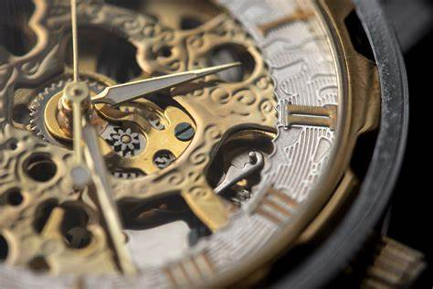

> Everyone want to go back, but time waits for no one.

 

Staring at stars

Watching the moon

Hoping that one they'll lead me to you

Wait every night

Cause if a star falls

I'll wish to go back to the times that I loved

Why do the stars shine so bright in the sky

If most of the people are sleeping at night

Why do we only have one chance at life

I wish I could go back in time

 

---

 

Pictures remind me of the things I forget

But also of all of the things that I've lost

Can't get them back they won't fall from above

So I try to forget all the times that I loved

Why do we remember beautiful lies

We end up regretting them most of our lives

Why do we only have one chance to try

I wish I could go back in time

Each time I fall asleep

I always see you there in my dreams

It's like going back in a time mechine

I know when I wake up your time with me will end

So don't let me fall asleep

I don't wanna meet you there in my dreams

I know that we'll never build a time machine

It's time for me to try and wake up again

I fall asleep

But honestly

I wanna see you in my dreams

I'm trying to wake up again
